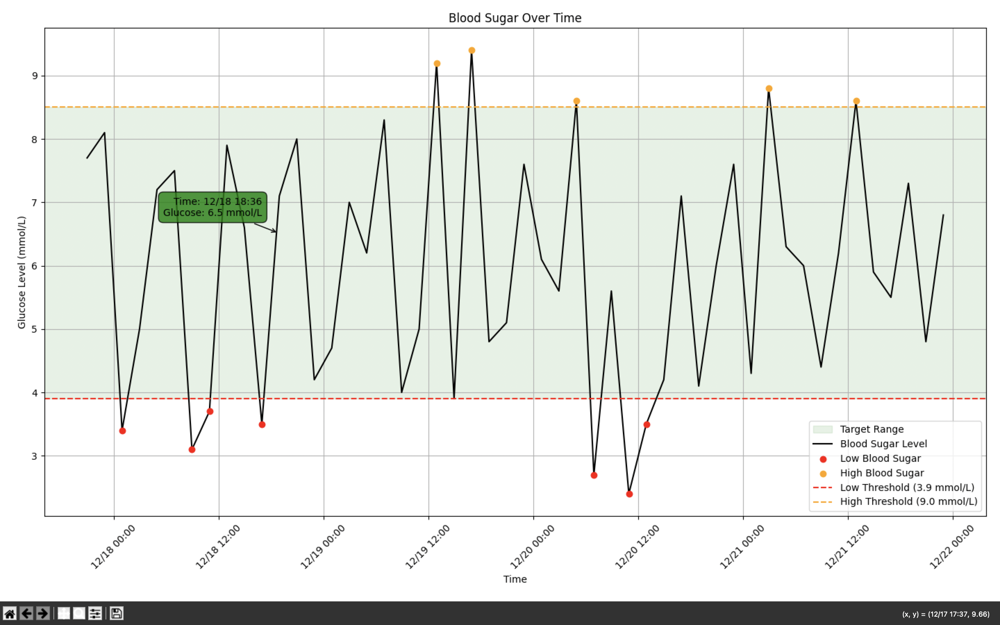
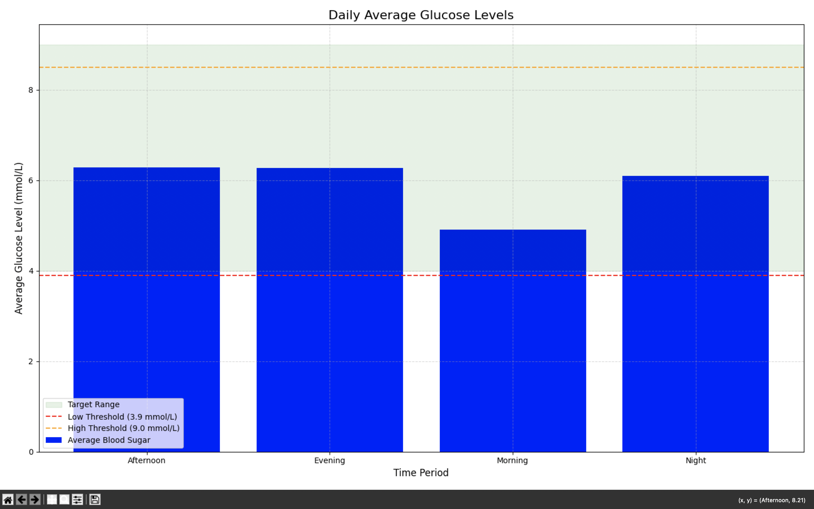
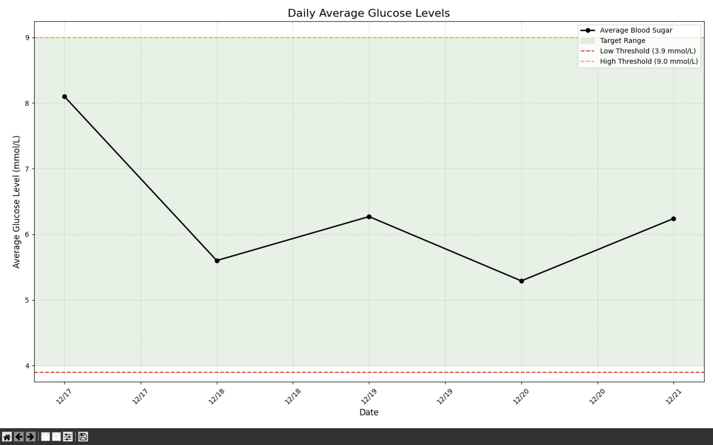
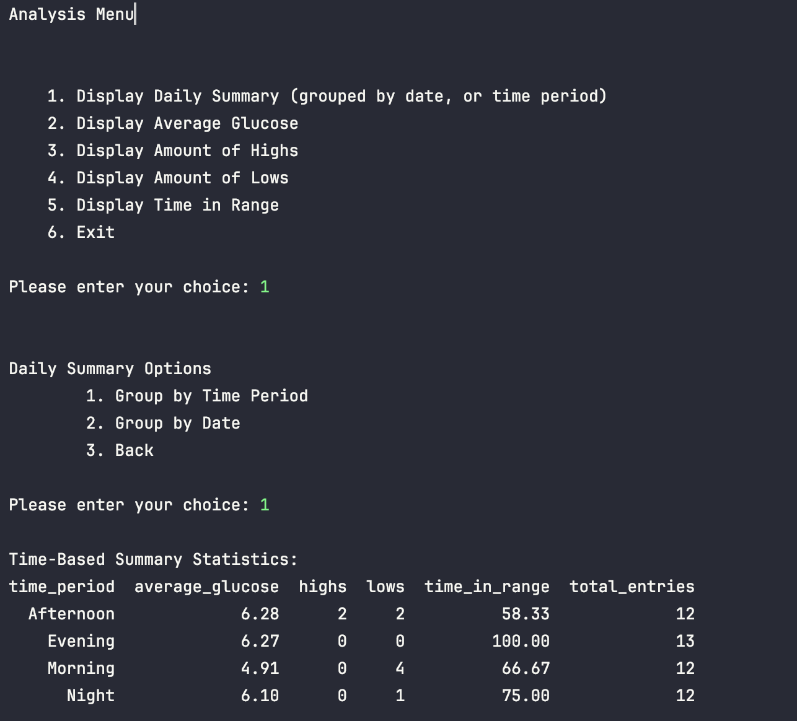
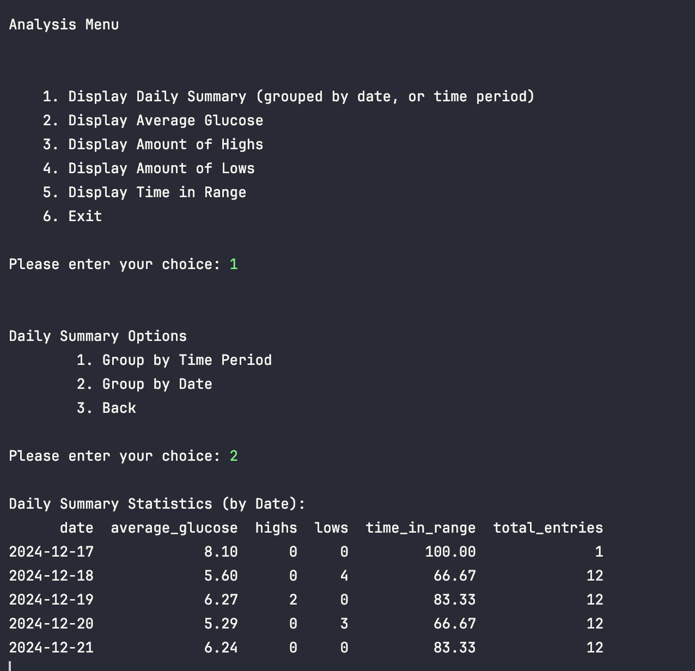
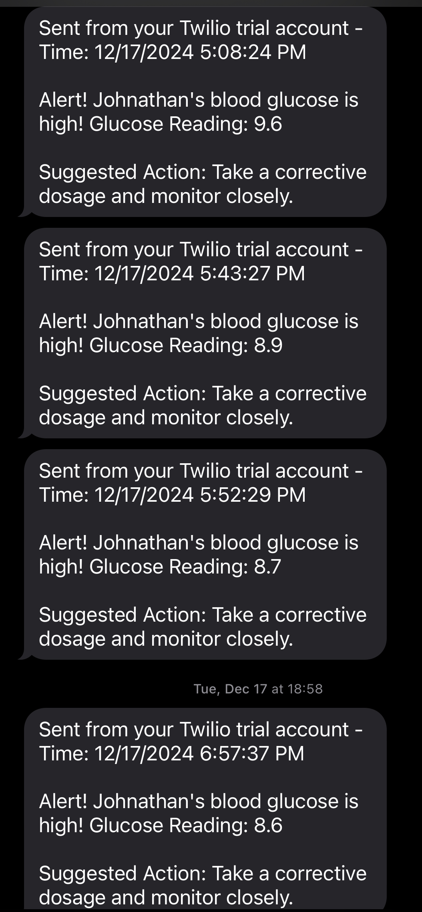

# DiaComp: A Comprehensive Blood Sugar Management Tool

## Overview 
DiaComp is a Python-based application for analyzing and visualizing blood glucose data. It gives users the ability to 
monitor trends, gain insights into blood sugar levels, and send SMS alerts during high or low blood glucose events. 

## Features 
### Analysis and Visualization
- Graphs: Visualize blood sugar trends over user selected time periods.
- Summaries:
  - Daily average glucose levels.
  - Count of high and low glucose readings.
  - Percentage of time blood glucose is within the target range.

### Alerts and Notifications
- SMS Alerts: Sends real-time notifications when glucose levels are out of range

### Data Handling
- Filter by Date: Analyze data for specific periods (e.g., last 7 days, last 14 days)
- Database Management: Built-in sample database for quick setup and customization.

### User Interface
- Command Line Interface: Easy to navigate menu system for data analysis and visualization. 

## Tech Stack 
- Programming Language: Python
- Libraries:
  - Data analysis: pandas, numpy
  - Visualization: matplotlib, mplcursors
  - Database: SQLite
  - Environment Variables: dotenv
- SMS Alerts: Twilio API 

## Setup
### Requirements
1. Python 3.9+ installed on your system.
2. A Twilio account:
   - Sign up at [Twilio](https://www.twilio.com/en-us/signup-credits?utm_source=google&utm_medium=cpc&utm_term=twilio%20messaging&utm_campaign=Sitelink_G_S_NAMER_Brand_Twilio&cq_plac=&cq_net=g&cq_pos=&cq_med=&cq_plt=gp&gad_source=1&gclid=Cj0KCQiA9667BhDoARIsANnamQaFaoC1O0YPA46xdbDtOV3WEu3dvifuxiRCGmRGB5z1lEnJkeSYZX8aAsLlEALw_wcB)
   - Obtain your Account SID, Auth Token, and a Twilio Phone Number.
3. SQLite installed or use sample database provided (`sample_blood_sugar_data.db`)

### Installation 
1. Clone this repository: ```bash git clone https://github.com/yourusername/diacomp.git```
2. Go to the project directory: `cd diacomp`
3. Install dependencies: `pip install -r requirements.txt`
4. Set up environment variables:
   - Create a `.py` file in the root directory 
   - Add your Twilio credentials:
     - `account_sid = "your_account_sid_here"`\
        `auth_token = "your_auth_token_here"`\
        `twilio_number = "+your_twilio_number_here"`\
        `target_number = "+recipient_number_here"`
   - Create a `.env` file in the root directory
   - Add glucose thresholds and LibreView credentials: 
     - `EMAIL = LibreView_Email.com`\
        `PASSWORD = LibreView_Password`\
        `USER_NAME = Name`\
        `MONITOR_INTERVAL = 5`\
        `LOW_THRESHOLD = 3.9`\
        `HIGH_THRESHOLD = 8.5`\
        `EXTREMELY_LOW_THRESHOLD = 2.8`\
        `EXTREMELY_HIGH_THRESHOLD = 20.0`
5. Use the provided sample database or create your own:
- Place `sample_blood_sugar_data.db` in the root directory
- To create a new database, run`database.py`.

## Usage
### Run the Application
Execute the `main.py` file to start monitoring glucose levels: `python main.py`
Execute the `data_visualization.py` file to view glucose levels over a time period: `python data_visualization.py`
Execute the `data_analysis.py` file to display menu: `python data_analysis.py`
### Menu Options 
1. **Daily Summaries**: View summaries by date or time period with visualizations.
2. **Average Glucose**: Calculate average glucose over a selected period.
3. **High/Low Counts**: Count occurrences of high and low glucose levels.
4. **Time in Range**: Calculate the percentage of time glucose was within the target range.
5. **Send Alerts**: Configure and send SMS alerts for critical glucose levels.

## Sample Data
A sample database is provided (`sample_blood_sugar_data.db) for quick testing. It
contains the following:
- **Blood Sugar Logs**: Sample glucose values with timestamps and alert types.
- **Insulin Doses**: Example insulin dose records.

### Database Schema
- **Blood Sugar Logs**
  - `id` : Unique ID
  - `timestamp`: Date and time of the reading (e.g., `12/15/2024 7:28:23 PM`)
  - `glucose_value`: Blood sugar level (mmol/L)
  - `alert_type`: High/Low alert
  - `log_type`: Manual or automatic
  - `notes`: Additional notes

- **Insulin Doses**
  - `id`: Unique ID
  - `timestamp`: Date and time of the dose
  - `dosage_amount`: Amount of insulin (units)
  - `dosage_type`: Bolus or Basal
  - `carbs`: Carbohydrates consumed (grams)

## Screenshots


### 1. **Data Visualization: Blood Sugar Levels**
This line graph shows the blood sugar levels over time, highlighting critical highs and lows with colour coded markers. 
The target range is shaded green for better visibility.


### 2. **Time-Based Summary**
This bar chart groups the average blood sugar levels by time period (Morning, Afternoon, Evening, Night).
It allows users to easily see patterns and make corrections for these time periods.


### 3. **Daily Summary**
This line graph highlights the daily average glucose levels, showing trends and how they compare to the thresholds.


### 4. **Terminal Interface**
#### Analysis Menu
The interactive CLI allows users to select various options for data analysis and visualization.


#### Daily Summary Outputs
Detailed terminal outputs for daily summaries, including average glucose, high/low counts, and time in range.


### 5. **SMS Alert**
This is an example of the SMS Alerts sent went blood glucose is high or low.

